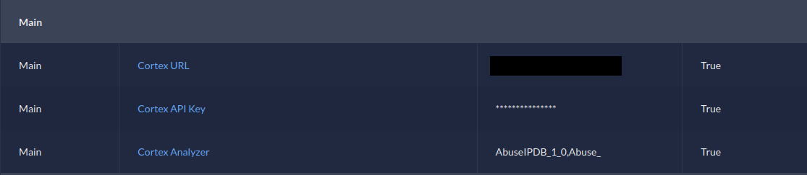

# DFIR-IRIS Cortex Analyzers Module 

[](./LICENSE)

`iris-cortexanalyzer-module` is an IRIS pipeline/processor module created with [dfir-iris/iris-skeleton-module](https://github.com/dfir-iris/iris-skeleton-module). This version of the module is a fork from [socfortress/iris-cortexanalyzer-module](https://github.com/socfortress/iris-cortexanalyzer-module). It offers extra functionalities, like multi-analyzer execution, separate job reports, and the addition of tags to the IOCs with the results of the analysis.

<br/>
<div align="center">
  
  <h3 align="center">DFIR-IRIS Cortex Analyzer Module</h3>
</div>

## Intro

Use the `Cortex Analyzer` module to run Cortex Analyzers via the DFIR-IRIS platform.

The module was tested with [DFIR-IRIS](https://github.com/dfir-iris/iris-web?tab=readme-ov-file):v 2.4.22 and [Cortex](https://hub.docker.com/r/thehiveproject/cortex/):3.2.1-1.

The module requires a working Cortex instance configured with an organization, a user with the read/analyze roles, and the user's API Key.

The module can be configured to run any Analyzer that supports the following IOC types:

+ `IP Address`
+ `Email Address`
+ `Domain`
+ `URL`
+ `Hash (MD5, SHA1, SHA224, SHA256, SHA3-224, SHA3-256, SHA3-384, SHA3-512, SHA384, SHA512)`

The module has been tested with the following Analyzers:

+ `AbuseIPDB_1_0`
+ `Abuse_Finder_3_0`
+ `CyberCrime-Tracker_1_0`
+ `Cyberprotect_ThreatScore_3_0`
+ `DShield_lookup_1_0`
+ `Hunterio_DomainSearch_1_0`
+ `Maltiverse_Report_1_0`
+ `MaxMind_GeoIP_4_0`
+ `Mnemonic_pDNS_Public_3_0`
+ `New_DomainMailSPFDMARC_Analyzer_1_1`
+ `OTXQuery_2_0`
+ `Urlscan_io_Search_0_1_1`
+ `VirusTotal_GetReport_3_1`
+ `VirusTotal_Rescan_3_1`
+ `VirusTotal_Scan_3_1`

> ⚠ **The Analyzers must be enabled within Cortex prior to running the module.**

## Installation

The below steps assume you already have your own DFIR-IRIS application up and running.

Fetch the `Cortex Analyzer Module` Repo.

```bash
git clone https://github.com/cybersec-ipb-pt/iris-cortexanalyzer-module
cd iris-cortexanalyzer-module
```

The required binary file can be built from scratch using the following commands:

```bash
python3 setup.py bdist_wheel

rm -r build dist iris_cortexanalyzer_module.egg-info

mv dist/iris_cortexanalyzer_module-1.1-py3-none-any.whl /path/to/iris-web/source/dependencies
```

Or use the pre-compiled [binary](./iris_cortexanalyzer_module-1.1-py3-none-any.whl):

```bash
cp iris_cortexanalyzer_module-1.1-py3-none-any.whl /path/to/iris-web/source/dependencies
```

Inside the `iris-web` directory, edit the `docker/webApp/Dockerfile`.

Locate the following line: 

```Dockerfile
RUN chmod +x iris-entrypoint.sh
```

On top of it add the following:

```Dockerfile
RUN pip3 install /iriswebapp/dependencies/iris_cortexanalyzer_module-1.1-py3-none-any.whl
```

Edit the `source/app/models/models.py` file.

Locate the following line:

```python
ioc_tags = Column(String(512))
```

Update it to the following.

```python
ioc_tags = Column(String(4096))
```

This step is required in order for IOC tags field to have enough space for the analysis results to be written. 

Next, execute the following commands to build and start the containers.

```bash
docker compose build
docker compose up -d
```

Execute the following commands to access the database and update the ioc_tags field.

```bash
docker exec -it iriswebapp_db bash -c "psql -U POSTGRES_USER -d POSTGRES_DB"
ALTER TABLE ioc
ALTER COLUMN ioc_tags TYPE VARCHAR(4096);
```

## Configuration

Once installed, configure the module to include:

+ Cortex API Endpoint (e.g., `http(s)://localhost:9001`)
+ Cortex API Key
+ Cortex Analyzer Names, separated by commas (e.g., `VirusTotal_GetReport_3_1,DShield_lookup_1_0`)

1. Navigate to `Advanced -> Modules`.

<div align="center" width="100" height="50">
  <h3 align="center">Advanced -> Modules</h3>
  <p align="center">
    <br/>
    
    <br/>
    <br/>
  </p>
</div>

2. Add a new module.

<div align="center" width="100" height="50">
  <h3 align="center">Add a new module</h3>
  <p align="center">
    <br/>
    
    <br/>
    <br/>
  </p>
</div>

3. Input the module name: `iris_cortexanalyzer_module`, and click on the `Validate module` button.

<div align="center" width="100" height="50">
  <h3 align="center">Input Module</h3>
  <p align="center">
    <br/>
    
    <br/>
    <br/>
  </p>
</div>

4. Configure the module, and click on the `Enable module` button.

<div align="center" width="100" height="50">
  <h3 align="center">Configure Module</h3>
  <p align="center">
    <br/>
    
    <br/>
    <br/>
  </p>
</div>

## Running the Module

To run the module select `Case -> IOC` and select the dropdown menu.

> Module currently supports IoC of type: `ip, email, url, domain, hash`

<div align="center" width="100" height="50">
  <h3 align="center">IoC</h3>
  <p align="center">
    <br/>
    
    <br/>
    <br/>
  </p>
</div>

<div align="center" width="100" height="50">
  <h3 align="center">Run Module</h3>
  <p align="center">
    <br/>
    
    <br/>
    <br/>
  </p>
</div>

> ## Refresh the webpage within your browser. 

<div align="center" width="100" height="100">
  <h3 align="center">Results</h3>
    <p align="center">
    <br/>
    
    <br/>
    <br/>
  </p>
  <p align="center">
    <br/>
    
    <br/>
    <br/>
  </p>
</div>

## Precautions

> **`Each time the module is executed, the Cortex Reports tab is updated and the previous information (if any) is removed.`**

> **`Since DFIR-IRIS shares IOCs between cases, an analysis performed on an IOC will be shared. This means that the Cortex Reports tab of an IOC and its tags will be present in other cases. To preserve the analysis performed in each case, it is recommended to take a print of the Cortex Reports tab and store it as evidence.`**

> **`Also, make sure to remove all tags from the IOC before reanalyzing the IOC on a different case.`**

> **`If DFIR-IRIS behavior changes in the future, this will no longer be necessary.`**